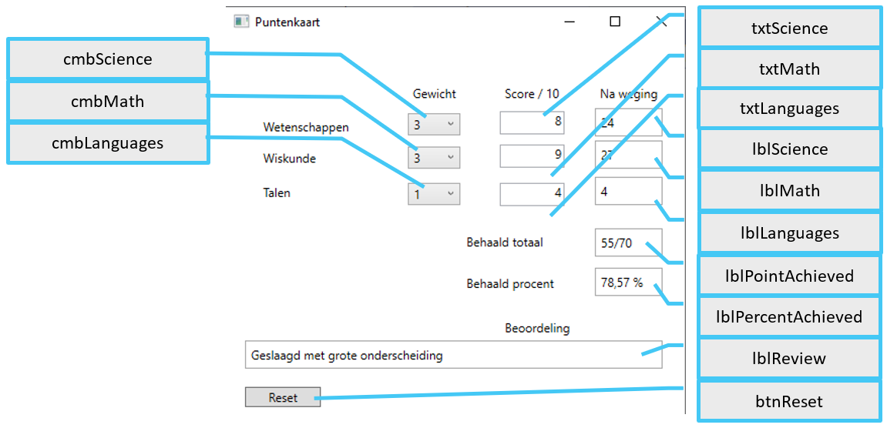

# Oefening 03  
## Selecties  
## Puntenkaart

De controls :   
  

De bedoeling is om voor 3 vakgebieden scores in te voeren gaande van 0 tot 10.  
Elk vakgebied heeft een bepaald gewicht in de totale score (gewichten 1, 2 of 3, te selecteren via de comboboxen).  
Wordt een score ingevoerd (TextChanged)  of een gewicht gewijzigd (SelectionChanged) dan dient telkens de volledige puntenkaart uitgerekend te worden.  
  
lblScience bijvoorbeeld vul je met gewicht wetenschappen x score wetenschappen (idem voor wiskunde en talen).  Dit zijn de gewogen resultaten.  
In lblPointAchieved plaats je dan het totaal van de 3 gewogen resultaten.   
In lblPercentAchieved plaats je de totaal behaalde score (uiteraard op 100 met 2 cijfers na de komma).   
   
Tenslotte dient lblReview nog gevuld te worden.  Volgende teksten kunnen verschijnen :     
  * Procent < 50 : “Niet geslaagd”  
  * Procent >= 50 en < 68 maar met 1 of meer onvoldoendes : “Geslaagd op voldoende wijze maar met herexamens”  
  * Procent >= 50 en < 68 zonder onvoldoendes : “Geslaagd op voldoende wijze”  
  * Procent >= 68 en < 77 (onvoldoendes spelen vanaf nu niet meer) : “Geslaagd met onderscheiding”  
  * Procent >=77 en < 85 : “Geslaagd met grote onderscheiding”  
  * Procent >= 85 en < 90 : “Geslaagd met grootste onderscheiding”  
  * Procent >= 90 : “Geslaagd met grootste onderscheiding en de gelukwensen van de examencommissie”  
    
Bij het opstarten èn klikken op btnReset :   
  * txtLanguages, txtScience en txtMath dienen gevuld te worden met “0”.
  * lblScience, lblMath, lblLanguages, lblPointAchieved, lblPercentAchieved en lblReview dienen leeggemaakt te worden.  
  
Maak je oefening eerst in de veronderstelling dat de gebruiker alles correct zal invoeren (dus punten invoert als getal van 0 t/m 10).  
Ben je hier mee klaar, probeer dan je programma wat robuuster te maken.  
  * Als de gebruiker bv tekst invoert vervang de invoer dan door “0”.  Je kan hiervoor gebruik maken van bv de int.TryParse methode.  
  * Controleer hierna ook of geen getal ingevoerd werd dat groter is dan 10.  Groter?  Vervang het door 10.  
   
Het verhoogt de kwaliteit van je programma wanneer je er voor zorgt dat wanneer één van de 3 textboxen de focus krijgt (de cursus komt er in terecht) je meteen alle tekst die daar in staat selecteert vanuit je code.  Je doet dit door in de GotFocus event-handler van een textbox het volgende te schrijven :   
  
>  private void TxtScience_GotFocus(object sender, RoutedEventArgs e)  
>  {  
>    txtScience.SelectAll();  
>  }  
